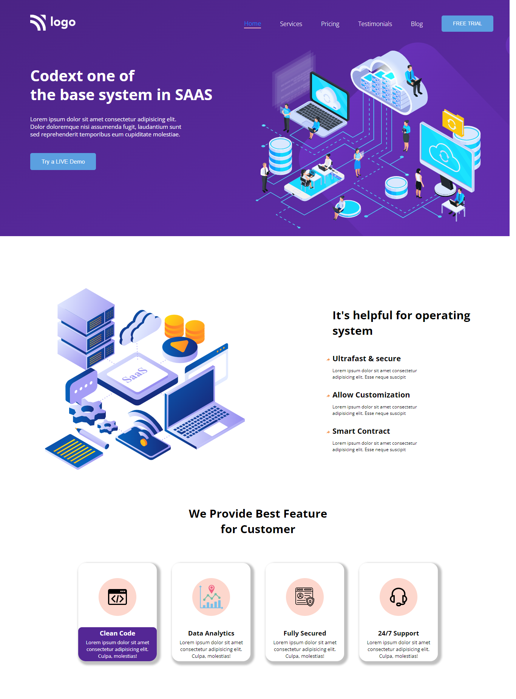

# SAAS Landing Page

***
## Description

This project [SAAS Landing Page]() was built using Semantic HTML and CSS from scratch. The goal was to design and build this webpage with HTML & CSS only and making it responsive with **@media queries**.The Project was completed under guidance of [Hitesh Choudhary](https://github.com/hiteshchoudhary), CTO Ineuron

***

### Links for Project

* [LIVE Project Link]()

* [Youtube Video Demo]()

* [Source Code]()

***
### Built With 

* Semantic HTML
* Custom CSS classes
* FlexBox
* Positions
* Media Queries

***

### Key Learnings

* Learned to handle CSS custom classes more effectively
* Learned using [flexbox](https://developer.mozilla.org/en-US/docs/Web/CSS/flex) and its properties
* Learned to make webpage responsive with the help of [media queries](https://developer.mozilla.org/en-US/docs/Web/CSS/Media_Queries/Using_media_queries)

***

### Time Taken to finish this project
 

>3 hours to build it from scratch.

>2 hours to make it responsive

 

***

### Screencapture of Project

 

  #### Whole Webpage

   

  

   

***
 

### Checkout Portfolio & Other Projects
 

#### [Personal Portfolio]()

#### [Findcoder Profile]()
***

### Connect with Me
* [Mailto](mailto:shubhambhoj3@gmail.com)
* [LinkedIn]()
* [Github]()
* [Findcoder]()
***
***
[go to top](#saas-landing-page)